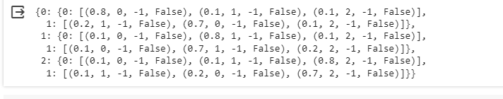

# MDP REPRESENTATION
## BY : Jeeva Abishake
## Register Number : 212221240018 

## AIM:
To represent a Markov Decision Process (MDP) problem for medical diagnosis based on patient's temperature and symptoms, with actions including prescription and consulting a doctor.
## PROBLEM STATEMENT:

### Problem Description
Consider an AI agent tasked with diagnosing a patient's health condition based on their temperature and reported symptoms. The agent must determine whether the patient is sick or healthy, and if sick, provide appropriate actions such as prescribing medication and recommending a consultation with a doctor.

### State Space
{Low, Normal, High} -> {0, 1, 2}

where,
Low represents the patient having a low temperature, Normal represents normal temperature, and High represents high temperature.
0 represents Low, 1 represents Normal, and 2 represents High.

### Sample State
Low -> 0
(The patient has a low temperature, represented numerically as 0.)
### Action Space
{Prescribe, Consult} -> {0, 1}
where,
Prescribe represents prescribing medication, and Consult represents recommending a consultation with a doctor.
0 represents Prescribe, and 1 represents Consult.

### Sample Action
Prescribe -> 0
(The action taken is to prescribe medication, represented numerically as 0.)

### Reward Function
R = { +1 , if the diagnosis is correct or closer to the actual condition
0 , otherwise}

### Graphical Representation


## PYTHON REPRESENTATION:
```python
import gym
import gym_walk
#P = gym.make('BanditWalk-v0').env.P
# Creating Dictionary
P = {
    0: {
        0: [(0.8, 0, -1, False), (0.1, 1, -1, False), (0.1, 2, -1, False)],
        1: [(0.2, 1, -1, False), (0.7, 0, -1, False), (0.1, 2, -1, False)]
    },
    1: {
        0: [(0.1, 0, -1, False), (0.8, 1, -1, False), (0.1, 2, -1, False)],
        1: [(0.1, 0, -1, False), (0.7, 1, -1, False), (0.2, 2, -1, False)]
    },
    2: {
        0: [(0.1, 0, -1, False), (0.1, 1, -1, False), (0.8, 2, -1, False)],
        1: [(0.1, 1, -1, False), (0.2, 0, -1, False), (0.7, 2, -1, False)]
    }
}

P

```

## OUTPUT:


## RESULT:
The given Markov Decision Process (MDP) problem for medical diagnosis based on patient's temperature and symptoms has been represented in text, graphical, and Python dictionary forms, considering three states for temperature.


